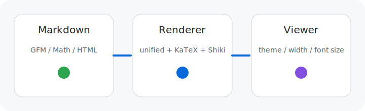

# Markdown Viewer Demo

この文書は手動確認用のサンプルです。

- GFM
- 数式
- コードハイライト
- 相対リンク
- 相対画像
- 生HTMLサニタイズ確認

## 目次代わりのリンク

- [数式セクションへ](#数式セクション)
- [コードセクションへ](#コードセクション)
- [別ページへ移動](linked.md)

## 表とタスクリスト

| 項目 | 値 |
| --- | --- |
| theme | GitHub Light |
| font size | 16px |
| text width | 760px |

- [x] GFM table
- [x] task list
- [x] relative image
- [ ] external image is blocked by design

## 引用

> Markdown Viewer は表示専用です。
> 外部エディタと併用して確認する想定です。

## 数式セクション

インライン数式: $e^{i\pi} + 1 = 0$

ブロック数式:

$$
\int_0^1 x^2 \, dx = \frac{1}{3}
$$

## コードセクション

```ts
const settings = {
  fontSize: 16,
  textWidth: 760,
  theme: "default",
};

console.log(settings);
```

## 相対画像



## 生HTML

<div class="custom-html-block">
  <strong>HTML block</strong> も描画されます。
</div>

<script>
  console.log('this should not execute');
</script>

## 外部リンク

- [Tauri](https://tauri.app/)
- [React](https://react.dev/)
